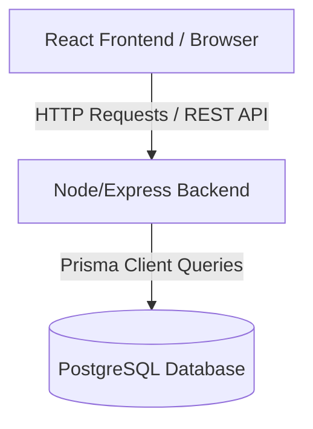
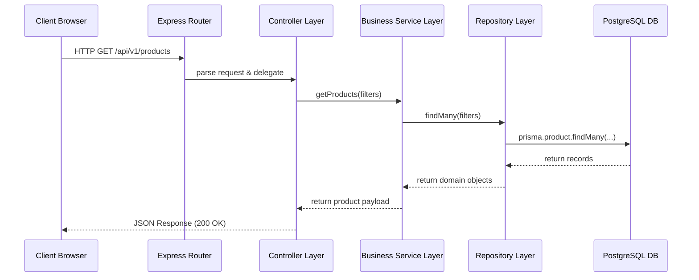

# System Architecture - Thread & Form

This document provides a high-level overview of the architectural design, patterns, and communication pathways used in the Thread & Form platform.

---

## High-Level Overview

Thread & Form is structured as a **decoupled Client-Server architecture**. The frontend application (running in the user's browser) is completely isolated from the backend API server.



### Components:

1. **Frontend Client (Vite + React):** Built as a Single Page Application (SPA). It manages the UI layout, routing, client-side session storage (JWT in headers/cookies), and component interactions.
2. **Backend API (Node + Express):** A stateless REST API. It handles incoming HTTP requests, performs authentication, runs business workflows, and acts as the gatekeeper to the database.
3. **Database Layer (Neon Serverless PostgreSQL):** Houses all relational entities (Users, Products, Orders, etc.) and enforces integrity constraints.

---

## Layered Backend Architecture

The backend codebase utilizes a **Three-Tier Architectural Pattern** to enforce the Single Responsibility Principle:



1. **Routing & Controllers (Interface Layer):**
   - **Routes** map URI patterns (e.g., `GET /api/v1/products`) to controllers.
   - **Controllers** inspect the HTTP request (`req.body`, `req.params`, `req.query`), parse input payloads, hand them to a service, and return clean JSON response objects using appropriate HTTP status codes (e.g., `200 OK`, `201 Created`, `400 Bad Request`, `401 Unauthorized`, `500 Server Error`).

2. **Services (Business Logic Layer):**
   - The services hold the "rules of the business". This includes checking if a user has enough funds, recalculating discounts based on coupons, calling payment gateways, or checking inventory before creating orders.
   - Services do not know about Express `req` or `res` objects. This keeps them clean and testable.

3. **Repositories & Models (Data Access Layer):**
   - **Repositories** act as a collection-like interface for database operations. Instead of writing database queries inside controllers or services, we group them into repository files (e.g., `productRepository.js`).
   - This prevents database-specific logic from leaking into our business rules, meaning we can change our database client or structure with minimal changes to services.

---

## Key Communication Principles

- **Stateless REST API:** The server does not store user session data in-memory (no session cookies). Instead, it expects a **JSON Web Token (JWT)** in the authorization headers for protected requests.
- **Unified Validation:** Incoming payloads are validated in the middleware layer using validators before reaching the controller.
- **Graceful Error Handling:** All errors are caught by standard middleware and serialized into a uniform error shape before reaching the client:
  ```json
  {
    "status": "error",
    "statusCode": 400,
    "message": "Detailed error explanation here"
  }
  ```
