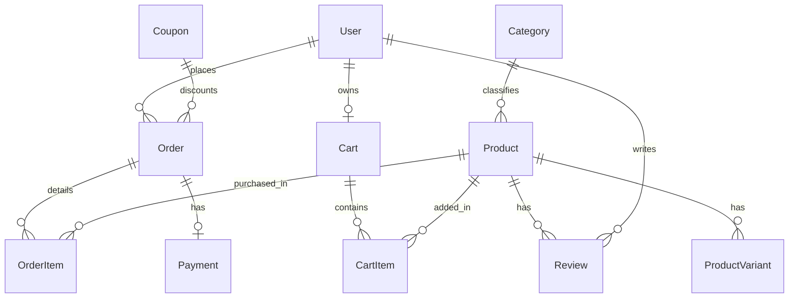

# Database Architecture & Management - Thread & Form

This document explains the relational database design, indexing strategies, seed logic, and migration steps for Thread & Form.

---

## Technology Stack

- **Engine:** PostgreSQL
- **Provider:** Neon Serverless PostgreSQL
- **ORM:** Prisma Client

---

## Conceptual Schema Model

The database holds resources supporting authentication, category tags, products, inventory checks, coupons, shopping carts, orders, and review ratings.



### Main Entities

1. **User:** User credentials, hashing passwords, roles (`customer`, `admin`).
2. **Product & Category:** Catalog metadata, descriptions, pricing, inventory limits.
3. **Cart & CartItem:** In-progress user selections (synchronized to database for cross-device retrieval).
4. **Order & OrderItem:** Permanent purchase histories, price snapshots, fulfillment statuses.
5. **Coupon:** Active promo codes, discount types (`percentage`, `fixed`), expiry limits.

---

## Local Development Workflow

### 1. Prisma Client Initialization

To sync Prisma with database schemas and regenerate the Javascript helper client:

```bash
npx prisma generate
```

### 2. Creating Database Migrations

When you modify the model configurations inside `server/prisma/schema.prisma`:

1. Run a dev migration command:
   ```bash
   npx prisma migrate dev --name name_of_change
   ```
2. This creates a SQL migration file in `server/prisma/migrations/` and updates the target database schema.

### 3. Database Seeding

To populate local or testing databases with initial stock categories and items:

- Command: `npm run db:seed`
- Location of script: [server/src/database/seed.js](file:///d:/COSPLAY.COM/server/src/database/seed.js)
